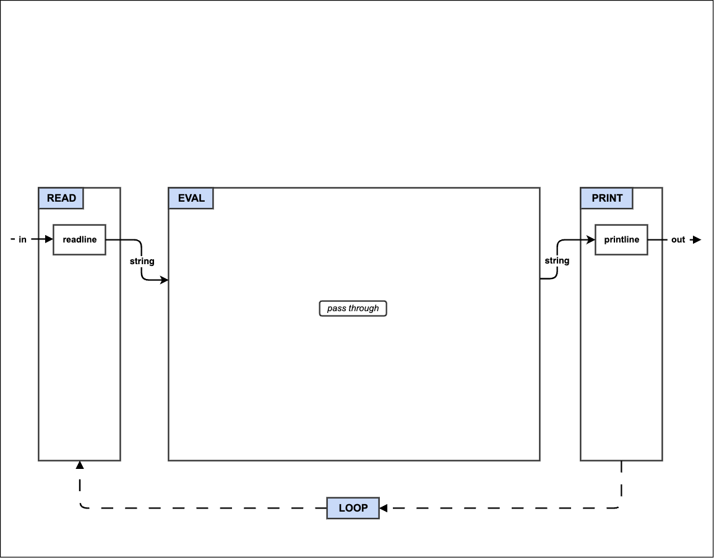
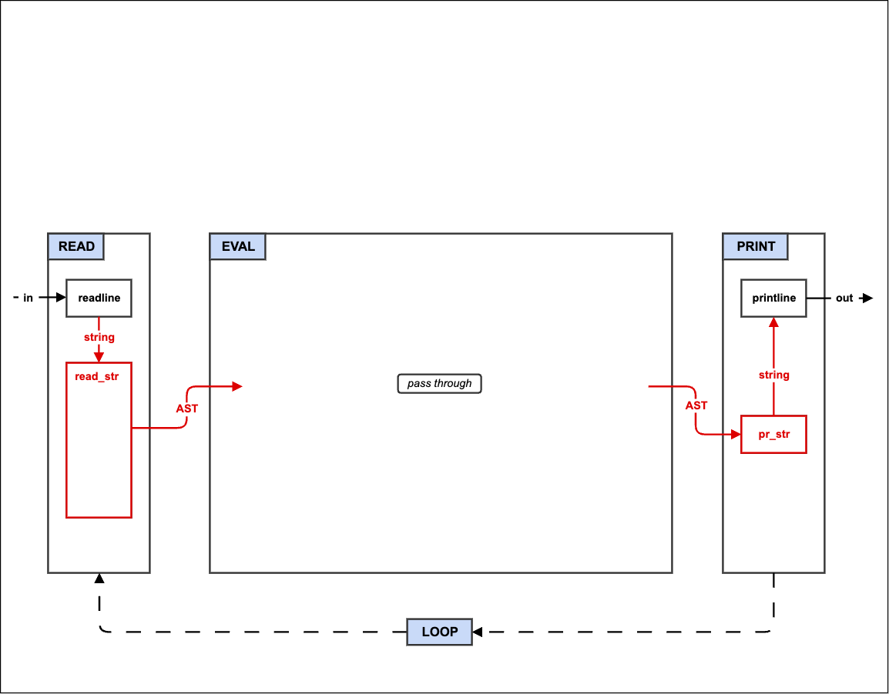
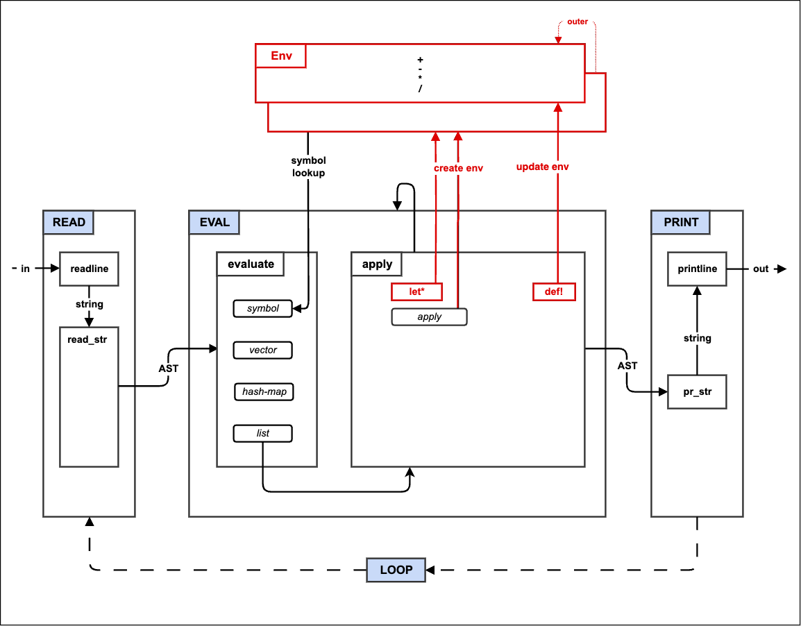
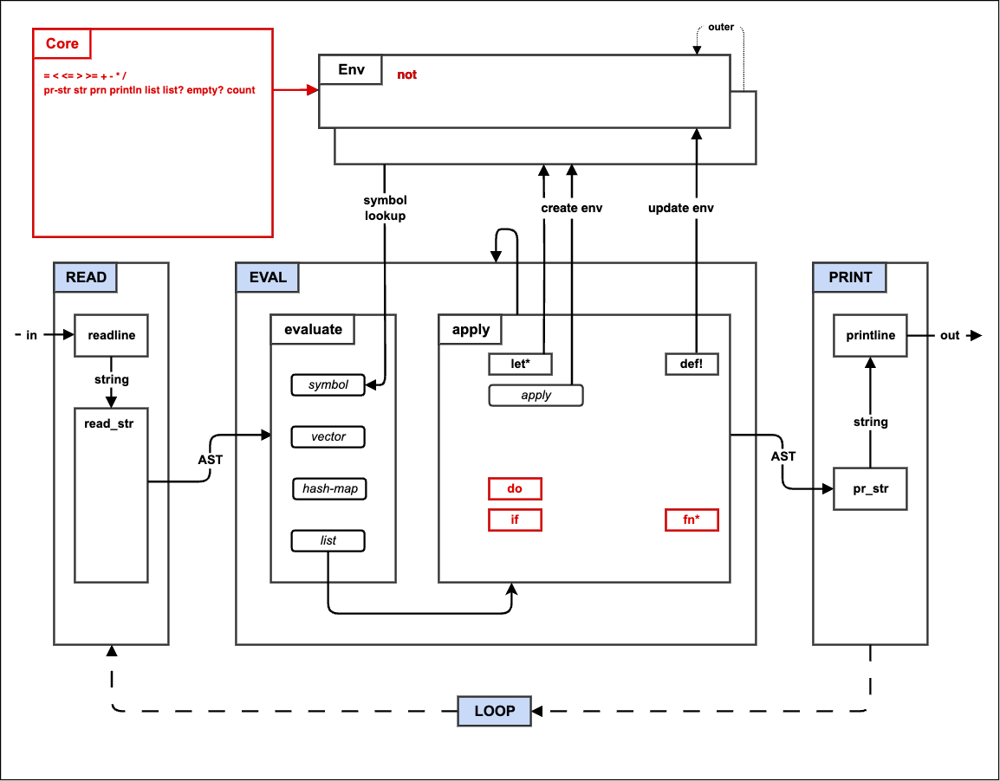
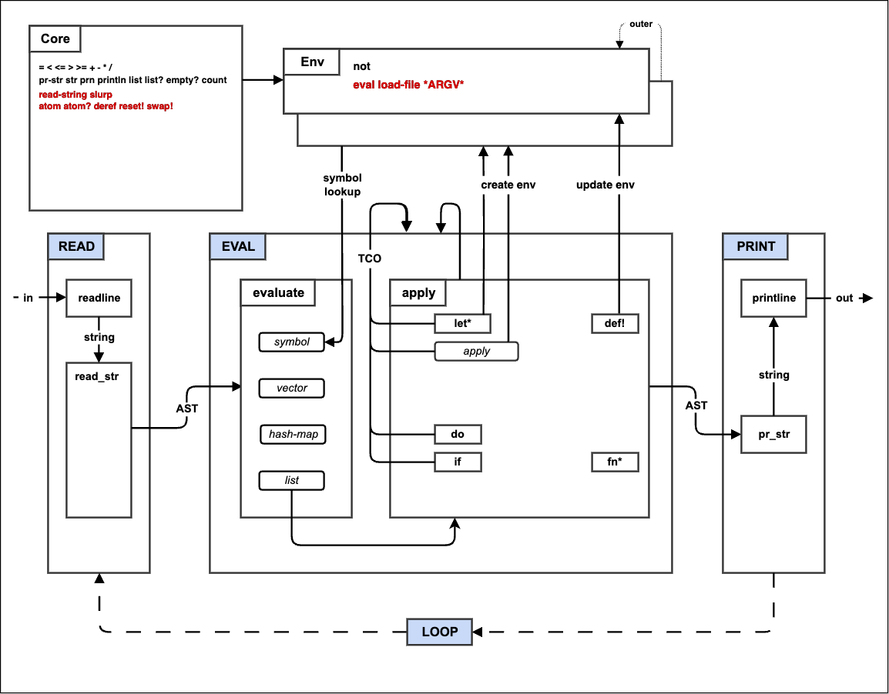
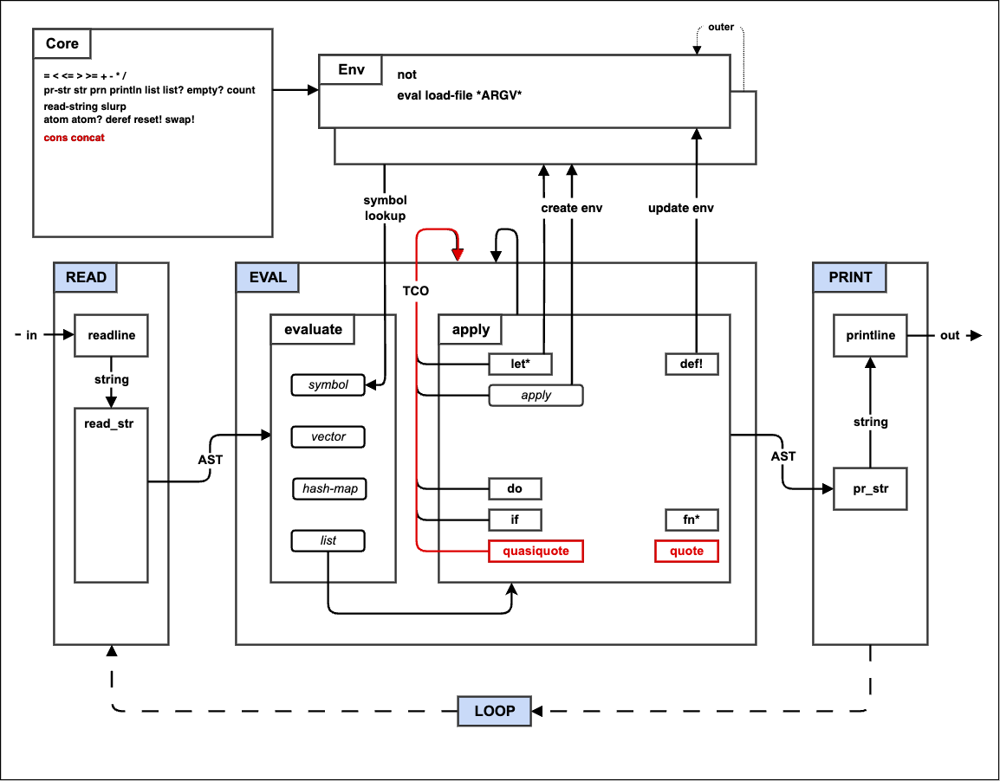
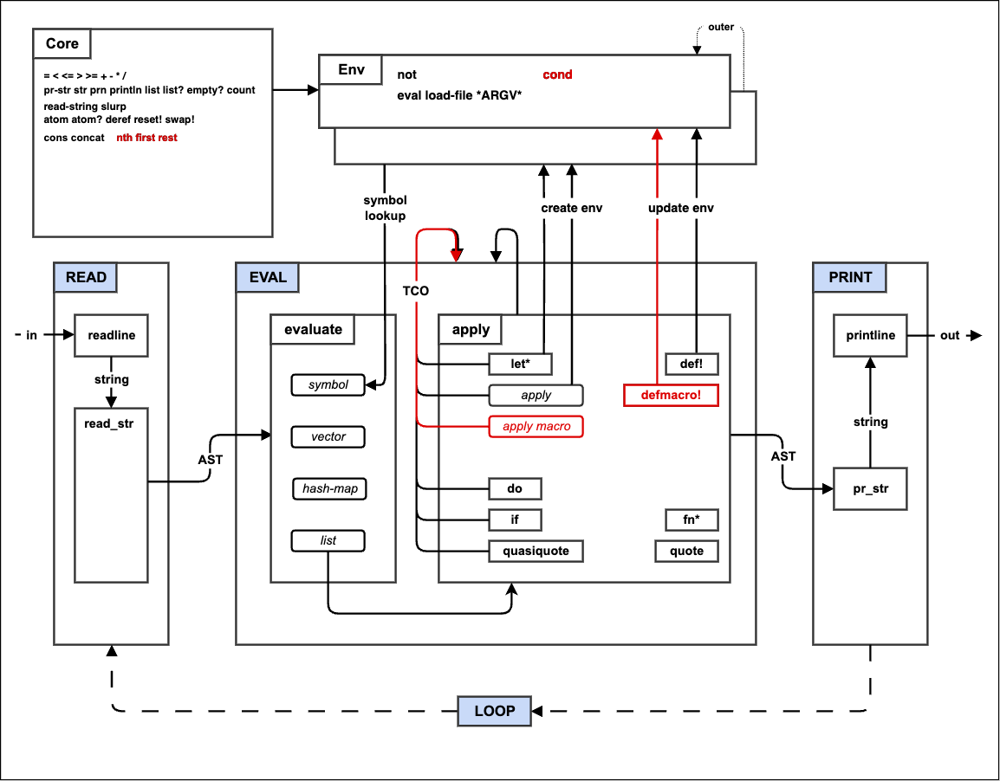
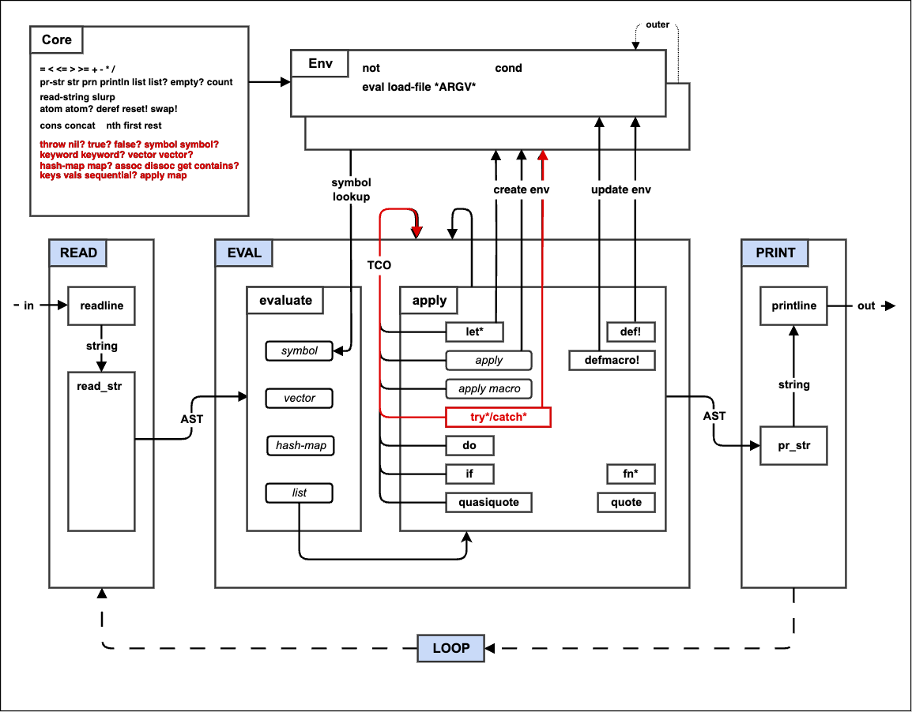
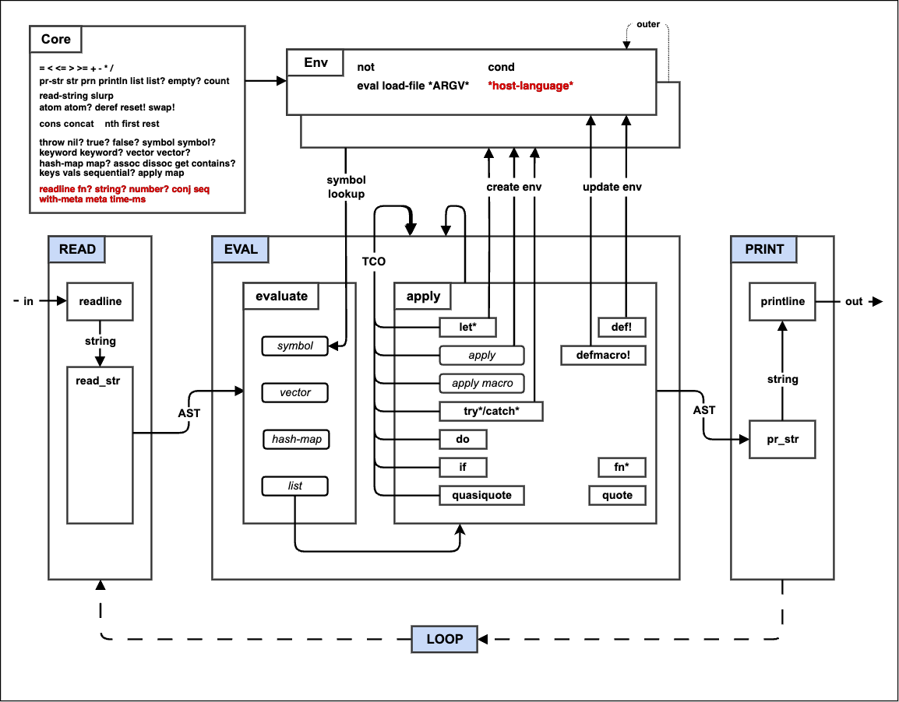

# The Make-A-Lisp Process

So you want to write a Lisp interpreter? Welcome!

The goal of the Make-A-Lisp project is to make it easy to write your
own Lisp interpreter without sacrificing those many "Aha!" moments
that come from ascending the McCarthy mountain. When you reach the peak
of this particular mountain, you will have an interpreter for the mal
Lisp language that is powerful enough to be self-hosting, meaning it
will be able to run a mal interpreter written in mal itself.

So jump right in (er ... start the climb)!

## Pick a language

You might already have a language in mind that you want to use.
Technically speaking, mal can be implemented in any sufficiently
complete programming language (i.e. Turing complete), however, there are a few
language features that can make the task MUCH easier. Here are some of
them in rough order of importance:

* A sequential compound data structure (e.g. arrays, lists,
  vectors, etc)
* An associative compound data structure (e.g. a dictionary,
  hash-map, associative array, etc)
* Function references (first class functions, function pointers,
  etc)
* Real exception handling (try/catch, raise, throw, etc)
* Variable argument functions (variadic, var args, splats, apply, etc)
* Function closures
* PCRE regular expressions

In addition, the following will make your task especially easy:

* Dynamic typing / boxed types (specifically, the ability to store
  different data types in the sequential and associative structures
  and the language keeps track of the type for you)
* Compound data types support arbitrary runtime "hidden" data
  (metadata, metatables, dynamic fields attributes)

Here are some examples of languages that have all of the above
features: JavaScript, Ruby, Python, Lua, R, Clojure.

Many of the most popular languages already have Mal implementations.
However, this should not discourage you from creating your own
implementation in a language that already has one. However, if you go
this route, I suggest you avoid referring to the existing
implementations (i.e. "cheating") to maximize your learning experience
instead of just borrowing mine. On the other hand, if your goal is to
add new implementations to mal as efficiently as possible, then you
SHOULD find the most similar target language implementation and refer
to it frequently.

If you want a fairly long list of programming languages with an
approximate measure of popularity, try the [Programming Language
Popularity Chart](http://langpop.corger.nl/)


## Getting started

* Install your chosen language interpreter/compiler, language package
  manager and build tools (if applicable)

* Fork the mal repository on github and then clone your forked
  repository:
```
git clone git@github.com:YOUR_NAME/mal.git
cd mal
```

* Make a new directory for your implementation. For example, if your
language is called "quux":
```
mkdir quux
```

* Modify the top level Makefile to allow the tests to be run against
  your implementation. For example, if your language is named "quux"
  and uses "qx" as the file extension, then make the following
  3 modifications to Makefile:
```
IMPLS = ... quux ...
...
quux_STEP_TO_PROG = mylang/$($(1)).qx
...
quux_RUNSTEP =  ../$(2) $(3)
```

This allows you to run tests against your implementation like this:
```
make test^quux^stepX
```


## General hints

Stackoverflow and Google are your best friends. Modern polyglot
developers do not memorize dozens of programming languages. Instead,
they learn the peculiar terminology used with each language and then
use this to search for their answers.

Here are some other resources where multiple languages are
compared/described:
* http://learnxinyminutes.com/
* http://hyperpolyglot.org/
* http://rosettacode.org/
* http://rigaux.org/language-study/syntax-across-languages/

Do not let yourself be bogged down by specific problems. While the
make-a-lisp process is structured as a series of steps, the reality is
that building a lisp interpreter is more like a branching tree. If you
get stuck on tail call optimization, or hash-maps, move on to other
things. You will often have a stroke of inspiration for a problem as
you work through other functionality. I have tried to structure this
guide and the tests to make clear which things are optional or can be
deferred until later.

An aside on optional bits: when you run the tests for a given step,
the last tests are often marked with an "optional" header. This
indicates that these are tests for functionality that is not critical
to finish a basic mal implementation. Many of the steps in this
process guide also have an "Optional" section, however, it is not
quite the same meaning. Those sections do include the functionality
that is marked as optional in the tests, but they also include
functionality that becomes mandatory at a later step. In other words,
this is a "make your own Lisp adventure".

Use test driven development. Each step of the make-a-lisp process has
a bunch of tests associated with it and there is an easy script to run
all the tests for a specific step in the process. Pick a failing test,
fix it, repeat until all the tests for that step pass.

The `process` directory contains abbreviated pseudocode and
architecture images for each step of the make-a-lisp process. Use
a textual diff/comparison tool to compare the previous pseudocode step
with the one you are working on. The architecture images have changes
from the previous step highlighted in red.

If you get stuck, find the same step or functionality in a different
implementation language.


## The Make-A-Lisp Process

In the steps that follow the name of the target language is "quux" and
the file extension for that language is "qx".


<a name="step0"></a>

### Step 0: The REPL



This step is basically just creating a skeleton of your interpreter.

* Create a `step0_repl.qx` file in `quux/`.

* Add the 4 trivial functions `READ`, `EVAL`, `PRINT`, and `rep`
  (read-eval-print). `READ`, `EVAL`, and `PRINT` are basically just
  stubs that return their first parameter (a string if your target
  language is a statically typed) and `rep` calls them in order
  passing the return to the input of the next.

* Add a main loop that repeatedly prints a prompt, gets a line of
  input from the user, calls `rep` with that line of input, and then
  prints out the result from `rep`. It should also exit when you send
  it an EOF (often Ctrl-D).

* If you are using a compiled (ahead-of-time rather than just-in-time)
  language, then create a Makefile (or appropriate project definition
  file) in your directory.

Run your new program and make sure that it echos each line that you
type. Because step0 is so trivial, there are no automated tests to run
for it.

Add and then commit your new `step0_repl.qx` and `Makefile` to git.

Congratulations! You have just completed the first step of the
make-a-lisp process.


#### Optional:

* Add full line editing and command history support to your
  interpreter REPL. Many languages have a library/module that provide
  line editing support. Another option if your language supports it is
  to use an FFI (foreign function interface) to load and call directly
  into GNU readline, editline, or libnoise library. Add line
  editing interface code to `readline.qx`


<a name="step1"></a>

### Step 1: Read and Print



In this step, your interpreter will "read" the string from the user
and parse it into an internal tree data structure (an abstract syntax
tree) and then take that data structure and "print" it back to
a string.

In non-lisp languages, this step (called "lexing and parsing") can be
one of the most complicated parts of the compiler/interpreter. In
Lisp, the data structure that you want in memory is basically
represented directly in the code that the programmer writes
(homoiconicity).

For example, if the string is "(+ 2 (* 3 4))" then the read function
will process this into a tree structure that looks like this:
```
          List
         / |  \
        /  |   \
       /   |    \
  Sym:+  Int:2  List
               / |  \
              /  |   \
             /   |    \
         Sym:*  Int:3  Int:4
```

Each left paren and its matching right paren (lisp "sexpr") becomes
a node in the tree and everything else becomes a leaf in the tree.

If you can find code for an implementation of a JSON encoder/decoder
in your target language then you can probably just borrow and modify
that and be 75% of the way done with this step.

The rest of this section is going to assume that you are not starting
from an existing JSON encoder/decoder, but that you do have access to
a Perl compatible regular expressions (PCRE) module/library. You can
certainly implement the reader using simple string operations, but it
is more involved. The `make`, `ps` (postscript) and Haskell
implementations have examples of a reader/parser without using regular
expression support.

* Copy `step0_repl.qx` to `step1_read_print.qx`.

* Add a `reader.qx` file to hold functions related to the reader.

* If the target language has objects types (OOP), then the next step
  is to create a simple stateful Reader object in `reader.qx`. This
  object will store the tokens and a position. The Reader object will
  have two methods: `next` and `peek`. `next` returns the tokens at
  the current position and increments the position. `peek` just
  returns the token at the current position.

* Add a function `read_str` in `reader.qx`. This function
  will call `tokenizer` and then create a new Reader object instance
  with the tokens. Then it will call `read_form` with the Reader
  instance.

* Add a function `tokenizer` in `reader.qx`. This function will take
  a single single string and return an array/list
  of all the tokens (strings) in it. The following regular expression
  (PCRE) will match all mal tokens.
```
[\s,]*(~@|[\[\]{}()'`~^@]|"(?:\\.|[^\\"])*"|;.*|[^\s\[\]{}('"`,;)]*)
```

* Add the function `read_form` to `reader.qx`. This function
  will peek at the first token in the Reader object and switch on the
  first character of that token. If the character is a left paren then
  `read_list` is called with the Reader object. Otherwise, `read_atom`
  is called with the Reader Object. The return value from `read_form`
  is a mal data type. If your target language is statically typed then
  you will need some way for `read_form` to return a variant or
  subclass type. For example, if your language is object oriented,
  then you cal define a top level MalType (in `types.qx`) that all
  your mal data types inherit from. The MalList type (which also
  inherits from MalType) will contains a list/array of other MalTypes.
  If your language is dynamically typed then you can likely just
  return a plain list/array of other mal types.

* Add the function `read_list` to `reader.qx`. This function will
  repeatedly call `read_form` with the Reader object until it
  encounters a ')' token (if it reach EOF before reading a ')' then
  that is an error). It accumulates the results into a List type.  If
  your language does not have a sequential data type that can hold mal
  type values you may need to implement one (in `types.qx`).  Note
  that `read_list` repeatedly calls `read_form` rather than
  `read_atom`. This mutually recursive defintion between `read_list`
  and `read_form` is what allows lists to contain lists.

* Add the function `read_atom` to `reader.qx`. This function will
  look at the contents of the token and return the appropriate scalar
  (simple/single) data type value. Initially, you can just implement
  numbers (integers) and symbols . This will allow you to proceed
  through the next couple of steps before you will need to implement
  the other fundamental mal types: nil, true, false, and string. The
  remaining mal types: keyword, vector, hash-map, and atom do not
  need to be implemented until step 9 (but can be implemented at any
  point between this step and that). BTW, symbols types are just an
  object that contains a single string name value (some languages have
  symbol types already).

* Add a file `printer.qx`. This file will contain a single function
  `pr_str` which does the opposite of `read_str`: take a mal data
  structure and return a string representation of it. But `pr_str` is
  much simpler and is basically just a switch statement on the type of
  the input object:

  * symbol: return the string name of the symbol
  * number: return the number as a string
  * list: iterate through each element of the list calling `pr_str` on
    it, then join the results with a space separator, and surround the
    final result with parens

* Change the `READ` function in `step1_read_print.qx` to call
  `reader.read_str` and the `PRINT` function to call `printer.pr_str`.
  `EVAL` continues to simply return its input but the type is now
  a mal data type.

You now have enough hooked up to begin testing your code. You can
manually try some simple inputs:
  * `123` -> `123`
  * `   123  ` -> `123`
  * `abc` -> `abc`
  * `   abc   ` -> `abc`
  * `(123 456)` -> `(123 456)`
  * `(  123   456 789   )   ` -> `(123 456 789)`
  * `(  + 2   (*  3  4)  )  ` -> `(+ 2 (* 3 4))`

To verify that your code is doing more than just eliminating extra
spaces (and not failing), you can instrument your `reader.qx` functions.

Once you have gotten past those simple manual tests, it is time to run
the full suite of step 1 tests. Go to the top level and run the
following:
```
make test^quux^step1
```

Fix any test failures related to symbols, numbers and lists.

Depending on the functionality of your target language, it is likely
that you have now just completed one of the most difficult steps. It
is down hill from here. The remaining steps will probably be easier
and each step will give progressively more bang for the buck.

#### Optional:


* Add error checking to your reader functions to make sure parens
  are properly matched. Catch and print these errors in your main
  loop. If your language does not have try/catch style bubble up
  exception handling, then you will need to add explicit error
  handling to your code to catch and pass on errors without crashing.

* Add support for the other basic data type to your reader and printer
  functions: string, nil, true, and false. These become mandatory at
  step 4. When a string is read, a slash followed by a doublequote is
  translated into a plain doublequote character and a slash followed by
  "n" is translated into a newline. To properly print a string (for
  step 4 string functions), the `pr_str` function needs another
  parameter called `print_readably`. When `print_readably` is true,
  doublequotes and newlines are translated into their printed
  representations (the reverse of the reader). The `PRINT` function in
  the main program should call `pr_str` with print_readably set to
  true.

* Add support for the other mal types: keyword, vector, hash-map, and
  atom. TODO/TBD
  * keyword: just a string stored with unicode prefix (or char 127 if
    no unicode support).
  * vector: can be implemented with same underlying type as list if
    there is some mechanism for marking/distringuishing from a list.
  * hash-map: only need to implement string keys (which enables
    keyword keys since they are just special strings).

* Add support for reader macros which are special forms that are
  transformed into other forms during the read phase.

* Add comment support to your reader. The tokenizer should ignore
  tokens that start with ";". Your `read_str` function will need to
  properly handle when the tokenizer returns no values. The simplest
  way to do this is to return `nil` mal value. A cleaner option (that
  does not print `nil` at the prompt is to throw a special exception
  that causes the main loop to simply continue at the beginning of the
  loop without calling `rep`.


<a name="step2"></a>

### Step 2: Eval


In step 1 your mal interpreter was basically just a way to validate
input and eliminate extraneous white space. In this step you will turn
your interpreter into a simple number calculator by adding
functionality to the evaluator (`EVAL`).

Compare the pseudocode for step 1 and step 2 to get a basic idea of
the changes that will be made during this step:
```
diff -urp ../process/step1_read_print.txt ../process/step2_eval.txt
```

* Copy `step1_read_print.qx` to `step2_eval.qx`.

* Define a simple initial REPL environment. This environment is an
  associative structure that maps symbols (or symbol names) to
  numeric functions. For example, in python this would look something
  like this:
```
repl_env = {'+': lambda a,b: a+b,
            '-': lambda a,b: a-b,
            '*': lambda a,b: a*b,
            '/': lambda a,b: int(a/b)}
```

* Modify the `rep` function to pass the REPL environment as the second
  parameter for the `EVAL` call.

* Create a new function `eval_ast` which takes `ast` (mal data type)
  and an associative structure (the environment from above).
  `eval_ast` switches on the type of `ast` as follows:

  * symbol: lookup the symbol in the environment structure and return
    the value or raise an error no value is found
  * list: return a new list that is the result of calling `EVAL` on
    each of the members of the list
  * otherwise just return the original `ast` value

* Modify `EVAL` to check if the first parameter `ast` is a list.
  * `ast` is not a list: then return the result of calling `eval_ast`
    on it.
  * `ast` is a list: call `eval_ast` to get a new evaluated list. Take
    the first item of the evaluated list and call it as function using
    the rest of the evaluated list as its arguments.

If your target language does not have full variable length argument
support (e.g. variadic, vararg, splats, apply) then you will need to
pass the full list of arguments as a single parameter and split apart
the individual values inside of every mal function. This is annoying,
but workable.

The process of taking a list and invoking or executing it to return
something new is known in Lisp as the "apply" phase.

Try some simple expressions:

  * `(+ 2 3)` -> `5`
  * `(+ 2 (* 3 4))` -> `14`

The most likely challenge you will encounter is how to properly call
a function references using an arguments list.

Now go to the top level, run the step 2 tests and fix the errors.
```
make test^quux^step2
```

You now have a simple prefix notation calculator!


<a name="step3"></a>

### Step 3: Environments



In step 2 you were already introduced to REPL environment (`repl_env`)
where the basic numeric functions were stored and looked up. In this
step you will add the ability to create new environments (`let*`) and
modify exiting environments (`def!`).

A Lisp environment is an associative data structure that maps symbols (the
keys) to values. But Lisp environments have an additional important
function: they can refer to another environment (the outer
environment). During environment lookups, if the current environment
does not have the symbol, the lookup continues in the outer
environment, and continues this way until the symbol is either found,
or the outer environment is `nil` (the outermost environment in the
chain).

Compare the pseudocode for step 2 and step 3 to get a basic idea of
the changes that will be made during this step:
```
diff -urp ../process/step2_eval.txt ../process/step3_env.txt
```

* Copy `step2_eval.qx` to `step3_env.qx`.

* Create `env.qx` to hold the environment definition.

* Define an `Env` object that is instantiated with a single `outer`
  parameter and starts with an empty associative data structure
  property `data`.

* Define three methods for the Env object:
  * set: takes a symbol key and a mal value and adds to the `data`
    structure
  * find: takes a symbol key and if the current environment contains
    that key then return the environment. If no key is found and outer
    is not `nil` then call find (recurse) on the outer environment.
  * get: takes a symbol key and uses the `find` method to locate the
    environment with the key, then returns the matching value. If no
    key is found up the outer chain, then throws/raises a "not found"
    error.

* Update `step2_env.qx` to use the new `Env` type to create the
  repl_env (with a `nil` outer value) and use the `set` method to add
  the numeric functions.

* Modify `eval_ast` to call the `get` method on the `env` parameter.

* Modify the apply section of `EVAL` to switch on the first element of
  the list:
  * symbol "def!": call the set method of the current environment
    (second parameter of `EVAL` called `env`) using the unevaluated
    first parameter (second list element) as the symbol key and the
    evaluated second parameter as the value.
  * symbol "let*": create a new environment using the current
    environment as the outer value and then use the first parameter as
    a list of new bindings in the "let" environment. Take the second
    element of the binding list, call `EVAL` using the new "let*"
    environment as the evaluation environment, then call `set` on the
    "let" environment using the first binding list element as the key
    and the evaluated second element as the value. This is repeated
    for each odd/even pair in the binding list. Note in particular,
    the bindings earlier in the list can be referred to by later
    bindings. Finally, the second parameter (third element) of the
    original `let*` form is evaluated using the new "let*" environment
    and the result is returned as the result of the `let*` (the new
    let environment is discarded upon completion).
  * otherwise: call `eval_ast` on the list and apply the first element
    to the rest as before.

`def!` and `let*` are Lisp "specials" (or "special atoms") which means
that they are language level features and more specifically that the
rest of the list elements (arguments) may be evaluated differently (or
not at all) unlike the default apply case where all elements of the
list are evaluated before the first element is invoked. Lists which
contain a "special" as the first element are known as "special forms".
The are special because the follow special evaluation rules.

Try some simple environment tests:

  * `(def! a 6)` -> `6`
  * `a` -> `6`
  * `(def! b (+ a 2))` -> `8`
  * `(+ a b)` -> `14`
  * `(let* (c 2) c)` -> `2`

Now go to the top level, run the step 3 tests and fix the errors.
```
make test^quux^step3
```

You mal implementation is still basically just a numeric calculator
with save/restore capability. But you have set the foundation for step
4 where it will begin to feel like a real programming language.


An aside on mutation and typing:

The "!" suffix on symbols is used to indicate that this symbol refers
to a function that mutates something else. In this case, the `def!`
symbol indicates a special form that will mutate the current
environment. Many (maybe even most) of runtime problems that are
encountered in software engineering are a result of mutation. By
clearly marking code where mutation may occur, you can more easily
track down the likely cause of runtime problems when they do occur.

Another cause of runtime errors is type errors, where a value of one
type is unexpectedly treated by the program as a different and
incompatible type. Statically typed languages try to make the
programmer solve all type problems before the program is allowed to
run. Most Lisp variants tend to be dynamically typed (types of values
are checked when they are actually used at runtime).

As an aside-aside: The great debate between static and dynamic typing
debate can be understood by following the money. Advocates of strict
static typing use words like "correctness" and "safety" and thus get
government and academic funding. Advocates of dynamic typing use words
like "agile" and "time-to-market" and thus get venture capital and
commercial funding.


<a name="step4"></a>

### Step 4: If Fn Do



In step 3 you added environments and the special forms for
manipulating environments. In this step you will add 3 new special
forms (`if`, `fn*` and `do`) and add several more core functions to
the default REPL environment. Our new architecture will look like
this:

The `fn*` special form is how new user-defined functions are created.
In some Lisps, this special form is named "lambda".

Compare the pseudocode for step 3 and step 4 to get a basic idea of
the changes that will be made during this step:
```
diff -urp ../process/step3_env.txt ../process/step4_if_fn_do.txt
```

* Copy `step3_env.qx` to `step4_if_fn_do.qx`.

* If you have not implemented reader and printer support (and data
  types) for `nil`, `true` and `false`, you will need to do so for
  this step.

* Update the constructor/initializer for environments to take two new
  arguments: `binds` and `exprs`. Bind (`set`) each element (symbol)
  of the binds list to the respective element of the `exprs` list.

* Add support to `printer.qx` to print functions values. A string
  literal like "#<function>" is sufficient.

* Add the following special forms to `EVAL`.

  * `do`: Evaluate the all the elements of the list and return the
    final element (evaluated).
  * `if`: Evaluate the first parameter (second element). If the result
    (condition) is anything other than `nil` or `false`, then evaluate
    the second parammeter (third element of the list) and return the
    result.  Otherwise, evaluate the third parameter (fourth element)
    and return the result. If condition is false and there is no third
    parameter, then just return `nil`.
  * `fn*`: Return a new function closure. The body of that closure
    does the following:
    * Create a new environment using `env` (closed over from outer
      scope) as the `outer` parameter, the first parameter (second
      list element of `ast` from the outer scope) as the `binds`
      parameter, and the parameters to the closure as the `exprs`
      parameter.
    * Call `EVAL` on the second parameter (third list element of `ast`
      from outer scope), using the new environment. Use the result as
      the return value of the closure.

If your target language does not support closures, then you will need
to implement `fn*` using some sort of structure or object that stores
the values being closed over: the first and second elements of the
`ast` list (function parameter list and function body) and the current
environment `env`. In this case, your native functions will need to be
wrapped in the same way. You will probably also need a method/function
that invokes your function object/structure for the default case of
the apply section of `EVAL`.

Try out the basic functionality you have implemented:

  * `(fn* [a] a)` -> `#<function>`
  * `( (fn* [a] a) 7)` -> `7`
  * `( (fn* [a] (+ a 1)) 10)` -> `11`
  * `( (fn* [a b] (+ a b)) 2 3)` -> `5`

* Add a new file `core.qx` and define an associative data structure
  `ns` (namespace) that maps symbols to functions. Move the numeric
  function definitions into this structure.

* Modify `step4_if_fn_do.qx` to iterate through the `core.ns`
  structure and add (`set`) each symbol/function mapping to the
  REPL environment (`repl_env`).

* Add the following functions to `core.ns`:
  * `list`: take the parameters and return them as a list.
  * `list?`: return true if the first parameter is a list, false
    otherwise.
  * `empty?`: treat the first parameter as a list and return true if
    the list is empty and false if it contains any elements.
  * `count`: treat the first parameter as a list and return the number
    of elements that it contains.
  * `=`: compare the first two parameters and return true if they are
    the same type and contain the same value. In the case of equal
    length lists, each element of the list should be compared for
    equality and if they are the same return true, otherwise false.
  * `<`, `<=`, `>`, and `>=`: treat the first two parameters as
    numbers and do the corresponding numeric comparison, returning
    either true or false.

Now go to the top level, run the step 4 tests. There are a lot of
tests in step 4 but all of the non-optional tests that do not involve
strings should be able to pass now.

```
make test^quux^step4
```

Your mal implementation is already beginning to look like a real
language. You have flow control, conditionals, user-defined functions
with lexical scope, side-effects (if you implement the string
functions), etc. However, our little interpreter has not quite reach
Lisp-ness yet. The next several steps will take

#### Optional:

* Implement Clojure-style variadic function parameters. Modify the
  constructor/initializer for environments, so that if a "&" symbol is
  encountered in the `binds` list, the next symbol in the `binds` list
  after the "&" is bound to the rest of the `exprs` list that has not
  been bound yet.

* Defines a `not` function using mal itself. In `step4_if_fn_do.qx`
  call the `rep` function with this string:
  "(def! not (fn* (a) (if a false true)))".

* Implement the strings functions in `core.qx`. To implement these
  functions, you will need to implement the string support in the
  reader and printer (optional section of step 1). Each of the string
  functions takes multiple mal values, prints them (`pr_str`) and
  joins them together into a new string.
  * `pr-str`: calls `pr_str` on each argument with `print_readably`
    set to true, joins the results with " " and returns the new
    string.
  * `str`: calls `pr_str` on each argument with `print_readably` set
    to false, concatenates the results together ("" separator), and
    returns the new string.
  * `prn`:  calls `pr_str` on each argument with `print_readably` set
    to true, joins the results with " ", prints the string to the
    screen and then returns `nil`.
  * `println`:  calls `pr_str` on each argument with `print_readably` set
    to false, joins the results with " ", prints the string to the
    screen and then returns `nil`.


<a name="step5"></a>

### Step 5: Tail call optimization


In step 4 you added special forms `do`, `if` and `fn*` and you defined
some core functions. In this step you will add a Lisp feature called
tail call optimization (TCO). Also called "tail recursion" or
sometimes just "tail calls".

Several of the special forms that you have defined in `EVAL` end up
calling back into `EVAL`. For those forms that call `EVAL` as the last
thing that they do before returning (tail call) you will just loop back
to the beginning of eval rather than calling it again. The advantage
of this approach is that it avoids adding more frames to the call
stack. This is especially important in Lisp languages because they do
not tend to have iteration control structures preferring recursion
instead. However, with tail call optimization, recursion can be made
as stack efficient as iteration.

Compare the pseudocode for step 4 and step 5 to get a basic idea of
the changes that will be made during this step:
```
diff -urp ../process/step4_if_fn_do.txt ../process/step5_tco.txt
```

* Copy `step4_env.qx` to `step5_tco.qx`.

* Add a loop (e.g. while true) around all code in `EVAL`.

* Modify each of the following form cases to add tail call recursion
  support:
  * `let*`: remove the final `EVAL` call on the second `ast` argument
    (third list element). Set `env` (i.e. the local variable passed in
    as second parameter of `EVAL`) to the new let environment. Set
    `ast` (i.e. the local variable passed in as first parameter of
    `EVAL`) to be the second `ast` argument. Continue at the beginning
    of the loop (no return).
  * `do`: change the `eval_ast` call to evaluate all the parameters
    the except for the last (2nd list element up to but not
    including last). Set `ast` to the last element of `ast`. Continue
    at the beginning of the loop (`env` stays unchanged).
  * `if`: the condition continues to be evaluated, however, rather
    than evaluating the true or false branch, `ast` is set to the
    unevaluated value of the chosen branch. Continue at the beginning
    of the loop (`env` is unchanged).

* The return value from the `fn*` special form will now become an
  object/structure with attributes that allow the default invoke case
  of `EVAL` to do TCO on mal functions. Those attributes are:
  * `fn`: the original function value return in step 4
  * `ast`: the second `ast` argument (third list element) representing
    the body of the function.
  * `params`: the first `ast` argument (second list element)
    representing the parameter names of the function.
  * `env`: the current value of the `env` parameter of `EVAL`.

* The default "apply"/invoke case of `EVAL` must now be changed to
  account for the new object/structure returned by the `fn*` form.
  Continue to call `eval_ast` on `ast`. The first element is `f`.
  Switch on the type of `f`:
  * regular function (not one defined by `fn*`): apply/invoke it as
  * before (in step 4).
  * a `fn*` value: set `ast` to the `ast` attribute of `f`. Generate
    a new environment using the `env` and `params` attributes of `f`
    as the `outer` and `binds` arguments and rest `ast` arguments
    (list elements 2 through the end) as the `exprs` argument. Set
    `env` to the new environment. Continue at the beginning of the loop.

Run some manual tests from previous steps to make sure you have not
broken anything by adding TCO.

Now go to the top level, run the step 5 tests.

```
make test^quux^step5
```

Look at the step 5 test file `tests/step5_tco.mal`. The `sum-to`
function cannot be tail call optimized because it does something after
the recursive call (`sum-to` calls itself and then does the addition).
Lispers say that the `sum-to` is not in tail position. The `sum2`
function however, calls itself from tail position. In other words, the
recursive call to `sum2` is the last action that `sum2` does. Calling
`sum-to` with a large value will cause a stack overflow exception in
most target languages (some have super-special tricks they use to
avoid stack overflows).

Congratulations, your mal implementation already has a feature (TCO)
that most mainstream languages lack.


<a name="step6"></a>

### Step 6: Files and Evil



In step 5 you added tail call optimization. In this step you will add
some string and file operations and give your implementation a touch
of evil ... er, eval. And as long as your language supports function
closures, this step will be quite simple. However, to complete this
step, you must implement string type support, so if you have been
holding off on that you will need to go back and do so.

Compare the pseudocode for step 5 and step 6 to get a basic idea of
the changes that will be made during this step:
```
diff -urp ../process/step5_tco.txt ../process/step6_file.txt
```

* Copy `step5_tco.qx` to `step6_file.qx`.

* Add two new string functions to the core namespaces:
  * `read-string`: this function just exposes the `read_str` function
    from the reader. If your mal string type is not the same as your
    target language (e.g. statically typed language) then your
    `read-string` function will need to unbox (extract) the raw string
    from the mal string type in order to call `read_str`.
  * `slurp`: this function takes a file name (string) and returns the
    contents of the file as a string. Once again, if your mal string
    type wraps a raw target language string, then you will need to
    unmarshall (extract) the string parameter to get the raw file name
    string and marshall (wrap) the result back to a mal string type.

* In your main program, add a new `eval` (symbol) entry to your REPL
  environment. The value of the new entry is a regular function
  closure with a single argument `ast`. The closure calls the real
  `EVAL` function using the `ast` as the first argument and the REPL
  environment (closed over from outside) as the second argument.  The
  result of the `EVAL` call is returned.

* Define a `load-file` function using mal itself. In your main
  program call the `rep` function with this string:
  "(def! load-file (fn* (f) (eval (read-string (str \"(do \" (slurp f) \")\")))))".

Try out `load-file`:
  * `(load-file "../tests/incA.mal")` -> `9`
  * `(inc4 3)` -> `7`

The `load-file` function does the following:
  * Call `slurp` to read in a file by name. Surround the contents with
    "(do ...)" so that the whole file will be treated as a single
    program AST (abstract syntax tree).
  * Call `read-string` on the string returned from `slurp`. This uses
    the reader to read/convert the file contents into mal data/AST.
  * Call `eval` (the one in the REPL environment) on the AST returned
    from `read-string` to "run" it.

Now go to the top level, run the step 6 tests. The optional tests will
need support from the reader for comments, vectors and hash-maps:
```
make test^quux^step6
```

Congratulations, you now have a full-fledged scripting language that
can run other mal programs. However, the set of functions that are
available (from `core.qx`) is fairly limited. The bulk of the
functions you will add are described in step 9, but you will begin to
flesh them out over the next few steps to support quoting (step 7) and
macros (step 8).


#### Optional:

* Add the ability to run another mal program from the command line.
  Prior to the REPL loop, check if your mal implementation is called
  with command line arguments. If so, treat the first argument as
  a filename and use `rep` to call `load-file` on that filename, and
  finally exit/terminate execution.

* Add the rest of the command line arguments to your REPL environment
  so that programs that are run with `load-file` have access to their
  calling environmnet. Add a new "*ARGV*" (symbol) entry to your REPL
  environment. The value of this entry should be the rest of the
  command line arguments as a mal list value.


<a name="step7"></a>

### Step 7: Quoting



In step 7 you will add the special forms `quote` and `quasiquote` and
add supporting core functions `cons` and `concat`. The two quote forms
add a powerful abstraction for manipulating mal code itself
(meta-programming).

The `quote` special form indicates to the evaluator (`EVAL`) that the
parameter should not be evaluated (yet). At first glance, this might
not seem particular useful but an example of what this enables is the
ability for a mal program to refer to a symbol itself rather than the
value that it evaluates to. Likewise with lists. For example, consider
the following:

* `(prn abc)`: this will lookup the symbol `abc` in the current
  evaluation environment and print it. This will result in error if
  `abc` is not defined.
* `(prn (quote abc))`: this will print "abc" (prints the symbol
  itself). This will work regardless of whether `abc` is defined in
  the current environment.
* `(prn (1 2 3))`: this will result in an error because `1` is not
  a function and cannot be applied to the arguments `(2 3)`.
* `(prn (quote (1 2 3)))`: this will print "(1 2 3)".
* `(def! l (quote (1 2 3)))`: list quoting allows us to define lists
  directly in the code (list literal). Another way of doing this is
  with the list function: `(def! l (list 1 2 3))`.

The second special quoting form is `quasiquote`. This allows a quoted
list to have internal elements of the list that are temporarily
unquoted (normal evaluation). There are two special forms that only
mean something within a quasiquoted list: `unquote` and
`splice-unquote`. These are perhaps best explained with some examples:

* `(def! lst (quote (2 3)))` -> `(2 3)`
* `(quasiquote (1 (unquote lst)))` -> `(1 (2 3))`
* `(quasiquote (1 (splice-unquote lst)))` -> `(1 2 3)`

The `unquote` form turns evaluation back on for its argument and the
result of evaluation is put in place into the quasiquoted list. The
`splice-unquote` also turns evaluation back on for its argument, but
the evaluated value must be a list which is then "spliced" into the
quasiquoted list. The true power of the quasiquote form will be
manifest when it used together with macros (in the next step).

Compare the pseudocode for step 6 and step 7 to get a basic idea of
the changes that will be made during this step:
```
diff -urp ../process/step6_file.txt ../process/step7_quote.txt
```

* Copy `step6_file.qx` to `step7_quote.qx`.

* Before implementing the quoting forms, you will need to implement
* some supporting functions in the core namespace:
  * `cons`: this function takes a list as its second
    parameter and returns a new list that has the first argument
    prepended to it.
  * `concat`: this functions takes 0 or more lists as
    parameters and returns a new list that is a concatenation of all
    the list parameters.

An aside on immutability: note that neither cons or concat mutate
their original list arguments. Any references to them (i.e. other
lists that they may be "contained" in) will still refer to the
original unchanged value. Mal, like Clojure, is a language which uses
immutable data structures. I encourage you to read about the power and
importance of immutability as implemented in Clojure (from which
Mal borrows most of its syntax and feature-set).

* Add the `quote` special form. This form just returns its argument
  (the second list element of `ast`).

* Add the `quasiquote` special form. First implement a helper function
  `is_pair` that returns true if the parameter is a non-empty list.
  Then define a `quasiquote` function. This is called from `EVAL` with
  the first `ast` argument (second list element) and then `ast` is set
  to the result and execution continues at the top of the loop (TCO).
  The `quasiquote` function takes a parameter `ast` and has the
  following conditional:
  1. if `is_pair` of `ast` is false: return a new list containing:
     a symbol named "quote" and `ast`.
  2. else if the first element of `ast` is a symbol named "unquote":
     return the second element of `ast`.
  3. if `is_pair` of first element of `ast` is true and the first
     element of first element of `ast` (`ast[0][0]`) is a symbol named
     "splice-unquote": return a new list containing: a symbol named
     "concat", the second element of first element of `ast`
     (`ast[0][1]`), and the result of calling `quasiquote` with the
     second through last element of `ast`.
  4. otherwise: return a new list containing: a symbol named "cons", the
     result of calling `quasiquote` on first element of `ast`
     (`ast[0]`), and result of calling `quasiquote` with the second
     through last element of `ast`.


Now go to the top level, run the step 7 tests:
```
make test^quux^step7
```

Quoting is one of the more mundane functions available in mal, but do
not let that discourage you. Your mal implementation is almost
complete, and quoting sets the stage for the next very exiting step:
macros.


#### Optional

* The full names for the quoting forms are fairly verbose. Most Lisp
  languages have a short-hand syntax and Mal is no exception. These
  short-hand syntaxes are known as reader macros because they allow us
  to manipulate mal code during the reader phase. Macros that run
  during the eval phase are just called "macros" and are described in
  the next section. Expand the conditional with reader `read_form`
  function to add the following four cases:
  * token is "'" (single quote): return a new list that contains the
    symbol "quote" and the result of reading the next form
    (`read_form`).
  * token is "`" (back-tick): return a new list that contains the
    symbol "quasiquote" and the result of reading the next form
    (`read_form`).
  * token is "~" (tilde): return a new list that contains the
    symbol "unquote" and the result of reading the next form
    (`read_form`).
  * token is "~@" (tilde + at sign): return a new list that contains
    the symbol "splice-unquote" and the result of reading the next
    form (`read_form`).

* Add support for quoting of vectors. The `is_pair` function should
  return true if the argument is a non-empty list or vector. `cons`
  should also accept a vector as the second argument. The return value
  is a list regardless. `concat` should support concatenation of
  lists, vectors, or a mix or both. The result is always a list.


<a name="step8"></a>

### Step 8: Macros



Your mal implementation is now ready for one of the most Lispy and
exciting of all programming concepts: macros. In the previous step,
quoting enabled some simple manipulation data structures and therefore
manipulation of mal code (because the `eval` function from step
6 turns mal data into code). In this step you will be able to mark mal
functions as macros which can manipulate mal code before it is
evaluated. In other words, macros are user-defined special forms. Or
to look at it another way, macros allow mal programs to redefine
the mal language itself.

Compare the pseudocode for step 7 and step 8 to get a basic idea of
the changes that will be made during this step:
```
diff -urp ../process/step7_quote.txt ../process/step8_macros.txt
```

* Copy `step7_quote.qx` to `step8_macros.qx`.


You might think that the infinite power of macros would require some
sort of complex mechanism, but the implementation is actually fairly
simple.

* Add a new attribute `is_macro` to mal function types. This should
  default to false.

* Add a new special form `defmacro!`. This is very similar to the
  `def!` form, but before the evaluated value (mal function) is set in
  the environment, the `is_macro` attribute should be set to true.

* Add a `is_macro_call` function: This function takes arguments `ast`
  and `env`. It returns true if `ast` is a list that contains a symbol
  as the first element and that symbol refers to a function in the
  `env` environment and that function has the `is_macro` attribute set
  to true. Otherwise, it returns false.

* Add a `macroexpand` function: This function takes arguments `ast`
  and `env`. It calls `is_macro_call` with `ast` and `env` and loops
  while that condition is true. Inside the loop, the first element of
  the `ast` list (a symbol), is looked up in the environment to get
  the macro function. This macro function is then called/applied with
  the rest of the `ast` elements (2nd through the last) as arguments.
  The return value of the macro call becomes the new value of `ast`.
  When the loop completes because `ast` no longer represents a macro
  call, the current value of `ast` is returned.

* In the evaluator (`EVAL`) before the special forms switch (apply
  section), perform macro expansion by calling the `macroexpand`
  function with the current value of `ast` and `env`. Set `ast` to the
  result of that call. If the new value of `ast` is no longer a list
  after macro expansion, then return `ast`, otherwise continue with
  the rest of the apply section (special forms switch).

* Add a new special form condition for `macroexpand`. Call the
  `macroexpand` function using the first `ast` argument (second list
  element) and `env`. Return the result. This special form allows
  a mal program to do explicit macro expansion without applying the
  result (which can be useful for debugging macro expansion).

Now go to the top level, run the step 8 tests:
```
make test^quux^step8
```

There is a reasonably good chance that the macro tests will not pass
the first time. Although the implementation of macros is fairly
simple, debugging runtime bugs with macros can be fairly tricky. If
you do run into subtle problems that are difficult to solve, let me
recommend a couple of approaches:

* Use the macroexpand special form to eliminate one of the layers of
  indirection (to expand but skip evaluate). This will often reveal
  the source of the issue.
* Add a debug print statement to the top of your main `eval` function
  (inside the TCO loop) to print the current value of `ast` (hint use
  `pr_str` to get easier to debug output). Pull up the step8
  implementation from another language and uncomment its `eval`
  function (yes, I give you permission to violate the rule this once).
  Run the two side-by-side. The first difference is likely to point to
  the bug.

Congratulations! You now have a Lisp interpreter with a super power
that most non-Lisp languages can only dream of (I have it on good
authority that languages dream when you are not using them). If you
are not already familiar with Lisp macros, I suggest the following
excercise: write a recursive macro that handles postfixed mal code
(with the function as the last parameter instead of the first). Or
not. I have not actually done so myself, but I have heard it is an
interesting excercise.

In the next step you will add try/catch style exception handling to
your implementation in addition to some new core functions. After
step9 you will be very close to having a fully self-hosting mal
implementation. Let us continue!


### Optional

* Add the following new core functions which are frequently used in
  macro functions:
  * `nth`: this function takes a list (or vector) and a number (index)
    as arguments, returns the element of the list at the given index.
    If the index is out of range, this function raises an exception.
  * `first`: this function takes a list (or vector) as its argument
    and return the first element. If the list (or vector) is empty or
    is `nil` then `nil` is returned.
  * `rest`: this function takes a list (or vector) as its argument and
    returns a new list containing all the elements except the first.

* In the main program, use the `rep` function to define two new
  control structures macros. Here are the string arguments for `rep`
  to define these macros:
  * `cond`: "(defmacro! cond (fn* (& xs) (if (> (count xs) 0) (list 'if (first xs) (if (> (count xs) 1) (nth xs 1) (throw \"odd number of forms to cond\")) (cons 'cond (rest (rest xs)))))))"
  * `or`: "(defmacro! or (fn* (& xs) (if (empty? xs) nil (if (= 1 (count xs)) (first xs) `(let* (or_FIXME ~(first xs)) (if or_FIXME or_FIXME (or ~@(rest xs))))))))"


<a name="step9"></a>

### Step 9: Try



Compare the pseudocode for step 8 and step 9 to get a basic idea of
the changes that will be made during this step:
```
diff -urp ../process/step8_macros.txt ../process/step9_try.txt
```

* Copy `step8_macros.qx` to `step9_try.qx`.

* TODO/TBD


<a name="step9"></a>

### Step A: Interop and Self-hosting



Compare the pseudocode for step 9 and step A to get a basic idea of
the changes that will be made during this step:
```
diff -urp ../process/step9_try.txt ../process/stepA_mal.txt
```

* Copy `step9_try.qx` to `stepA_mal.qx`.

* TODO/TBD


## TODO:

* simplify: "X argument (list element Y)" -> ast[Y]
* step 8 summary (power of macros, warning about macros, almost to
  self-hosting)
* step 9
* step A
* more info on hash-map and keyword implementation. Hash-maps just
  need to support string keys.
* list of types with metadata: list, vector, hash-map, mal functions
* more clarity about when to peek and poke in read_list and read_form
* tokenizer: use first group rather than whole match (to eliminate
  whitespace/commas)
